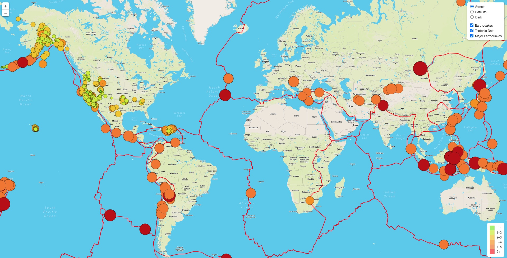
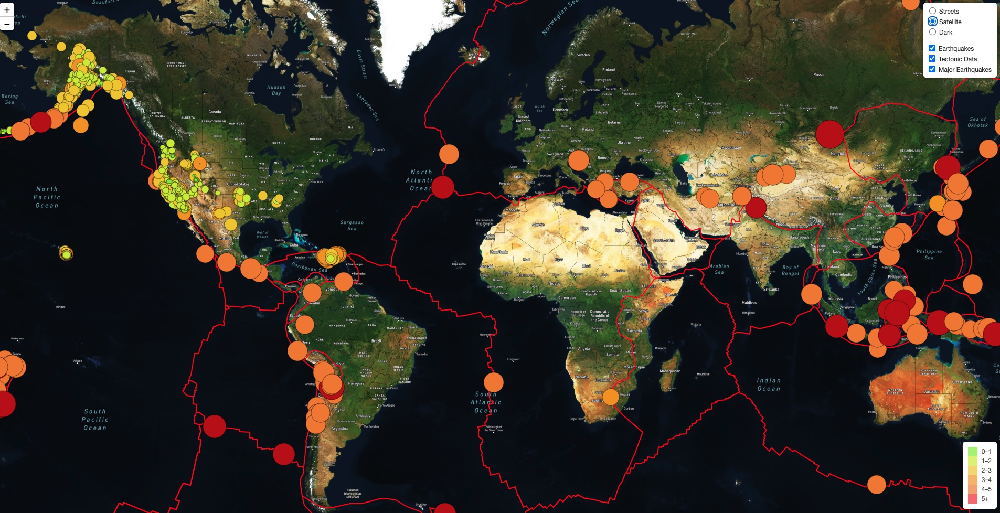
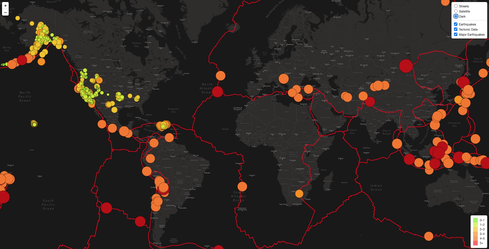
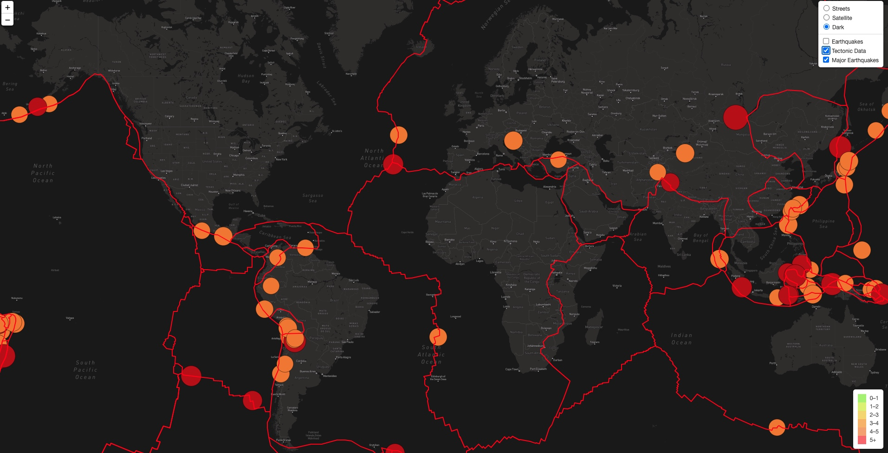

# Mapping__Earthquakes

## Overview

The purpose of this project is to create a earthquake map using leaflet and and mapbox that showcases the data for earthquakes all over the world in the last seven days, 

Additonally to the  general earthquake data, we also have tectonic plate data that was added to overlay the map and major earquake data with a magnitude greater than 4.5. 

## Results

The earthquake map contains three different tiles for the user to choose from by toggling over the legend on the bottom right corner: Streets, Satellite, and Dark. 

##### Street view

##### Satellite view

##### Dark view

Furthermore, we can toggle on and off the data we want to see. For instance, here we have toggled off the Earthquake data. 

